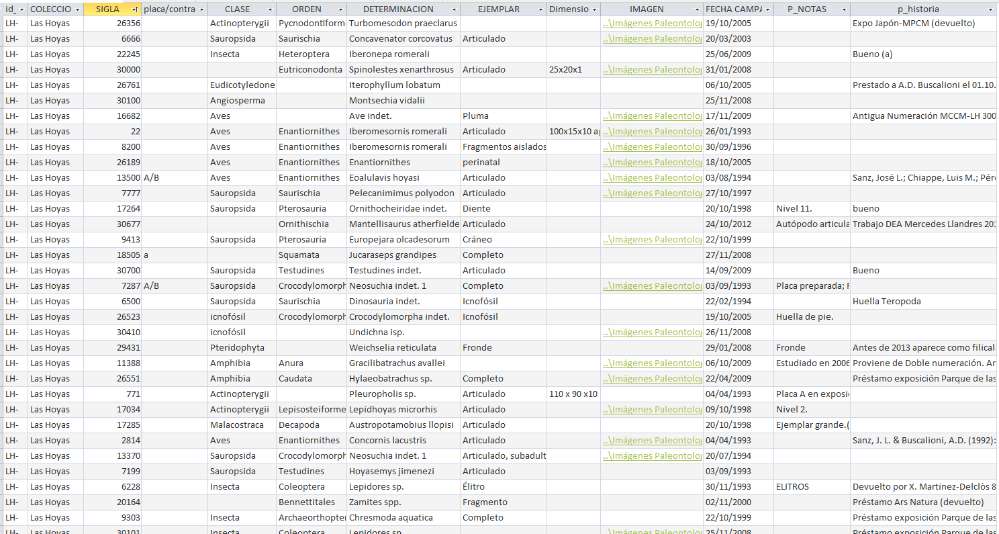

# Diseño base de datos

Changelog:

03/02: Modificado según lo hablado en [02/02/2026](https://www.notion.so/02-02-2026-2fb030cfa42980bc8132ee23697764b4?pvs=21), añadiendo todo lo de la prueba de concepto y modificando cómo se de-duplica todo

30/01: Añadido número de registros de la base de datos, y la sección con las macroclases. Añadida fase 0 e invertido el orden de fase 1 y fase 2

28/01: Explicados mejor y reordenados tanto algunos campos del modelo de datos como pasos del procedimiento

27/01: Actualizado con información tras ver la base de datos del Museo (modificaciones menores tanto en el modelo como en el procedimiento). Añadido también una captura de la base de datos al final del todo.

21/01: Terminada primera redacción completa, añadiendo el contenido del correo

19/01: Inicio del documento y primera versión

# Modelo de datos

- Identificación imagen
    - uuid: Un ID nuestro para tener cada imagen localizada independientemente de si les vamos cambiando el nombre o los fósiles van sin identificador, o lo que sea
    - specimen_id: El ID del fósil que está en la foto (y muchas veces en el nombre del fichero). Nos puede servir para ver que varias fotos son del mismo bicho
        - Si no tiene, igual se pueden ir poniendo unknown1, unknown2, unknown3… Otra opción sería usar el uuid también como specimen_id
        - Este campo en realidad es clave para poder cruzar el registro con el de la base de datos
    - original_path: Conservarlo por si viene bien. Por ejemplo, el path puede dar la información de la clasificación, de la fuente,de la campaña... De momento conservarlo, al final esta columna se borrará
- Taxonomía
    - genera_label: El género es la etiqueta que, para los de paleo, dice “el nombre del bicho” (determinación en la base de datos)
        - Igual los icnofósiles son excepciones que tenemos que ver cómo gestionar
    - class_label: Este es el nivel general (mamiferos, peces…) por el que podemos clasificar también
        - Igual los icnofósiles son excepciones que tenemos que ver cómo gestionar
    - macroclass_label: Esta va a ser nuestra macroclase para simplificar el problema. En la parte de abajo de este documento se especifica  cuáles son, y cómo agrupan las clases presentes en la base de datos
    - incertidumbre_taxonomica: No se si tenemos de esto anotado, pero en el TFG de Marina hay clases que en el nombre llevan letras que significa “no se está muy seguro de está clasificación” digamos, si lo tenemos tendría sentido recogerlo
        - En la determinación de la base de datos aparece con siglas a veces (sp, spp, indet, cf, aff…)
- Tafonomía
    - nivel_preservacion (preservación general del fósil)
    - nivel_fragmentacion (si está en pedazos)
    - porcentaje_visible (por si faltan partes del fósil, o están debajo de la roca)
    - nivel_desarticulacion (si están los huesos separados y esparcidos por la roca)
    - NOTA: algunos de estos campos tafonómicos aparecen en el campo “Ejemplar” de la base de datos, igual se pueden sacar keywords y sacarlo automáticamente en algunos casos
    - NOTA2: Hay algunos otros campos que también se pueden recoger, pero no se hasta que punto tienen sentido
        - tejido_blando (si hay conservado tejidos blandos del fósil)
        - tipo_conservación (limonita, fósforo…)
- Morfología
    - parte_anatómica (ala, cráneo, hoja…)
        - NOTA: a veces aparecen en el campo “Ejemplar” de la base de datos, igual se pueden sacar keywords y sacarlo automáticamente en algunos casos
- metadatos
    - fecha_captura (Hay una fecha campaña en la base de datos también)
        - Si no tiene o no la encontramos, definir una cadena por defecto 8por ejemplo yyyymmdd)
    - NOTA: Hay algunos otros campos que también se pueden recoger, pero no se hasta que punto tienen sentido
        - modelo_camara (no se si importa esto, aunque puede ser gratis de recopilar)
        - tipo (para separar las que son de láser por ejemplo)
- CV
    - poligono (o bbox si lo preferimos)
- Otros
    - tamaño (Hay dimensiones en algunos ejemplares en la base de datos)
    - escala disponible
    - fuente (MUPA, UAM…)
    - otros
    - NOTA: Hay algunos otros campos que también se pueden recoger, pero no se hasta que punto tienen sentido
        - fondo (viene del correo)
        - con_anotaciones_manuales (si hay info escrita en la roca)

Notas:

- No estamos anotando todo el arbol biológico del bicho, hay un paper que lo utilizaba para tratar de forzar el modelo a que si se equivocaba no estuviera muy lejos a nivel biológico (decir que un ave es de un tipo u otro, pero no confundirla con un helecho). A partir del género podemos sacarlo relativamente rápido si quisieramos hacer algo parecido

# Procedimiento

1. Extracción info previa
    - Recorrer todos los directorios que tenemos y extraer:
        - Árbol de directorios
        - Cuántos archivos tenemos de cada extensión
        - Cuántos tienen metadatos que nos sirvan
        - Cuántos directorios de los que tenemos se pueden parsear para extraer información útil
        - Cuántos nombres de los ficheros indican el specimen_id
        - Plantear hacerlo con un agente, si no, código “normal”
        - Igual mola crear alguna visualización, sobre todo para las reuniones
    - Revisión que el plan siga teniendo sentido con los datos extraídos
2. Filtrado rápido de imágenes no-útiles
    - Abrir una vista de mosaico sobre todas las imágenes y hacer un primer filtrado rápido manual de todas las que claramente se vea que son de otras cosas
    - Esto se podría hacer más tarde, pero las imágenes probablemente sean analizadas por LLMs, que van limitados por RPM/RPD, y quitarnos muchas imágenes de golpe va a hacer que podamos hacer todo el resto de cosas más rápido
    - De cualquier forma, no perder mucho tiempo aquí, generarse algo para poder ver la vista de mosaico entre todos los niveles, darse una vuelta por las imágenes quitando grupos grandes que sean de otras cosas y listo
3. Diseño prueba de concepto ordenación de datos
    - Diseñar una forma en la que, de la forma más automática posible, podamos ir limpiando un conjunto de datos, extrayendo en el proceso siempre que sea posible
        - Año de la campaña
        - specimen_id
        - Clase taxonómica
    - Documentar esa forma en [Diseño proyecto ordenación datos](https://www.notion.so/Dise-o-proyecto-ordenaci-n-datos-2fc030cfa42980aa9de7fb0477aba299?pvs=21)
        - Irá directorio principal a directorio principal
        - Extraerá toda la info que pueda de lo paths y del nombre del archivo, posiblemente usando LLMs por el medio
        - Ira juntando todos los datos limpios en nuevos directorios, deduplicando con los que ya estén presentes
        - Tratará de cruzar los specimen_id que se hayan obtenido con los que hay en la base de datos
4. Implementar todo el proceso de ordenación de datos
    - A partir de lo que se haya diseñado, hacerse un repositorio que implemente todo
5. Ejecución prueba de concepto en un directorio
    - Con su posterior evaluación para ver que todo se haya ejecutado bien, y corrección en caso de que no
6. Ordenación de datos general
    - Una vez el proceso funcione en un directorio probar en el siguiente, y luego en el siguiente, y así sucesivamente hasta que se hayan limpiado todos los datos
7. Creación documento esquema de anotación
    - En el que finalmente se recogen todos los campos, y se incluyen sus posibles valores, definiciones, etiquetas unknown/uncertain, reglas para casos especiales (fragmentos, superposiciones, fotos con regla/etiqueta, reflejos, etc.).
    - Definir si utilizamos formato COCO (preferible) o YOLO
    - Como herramienta en principio utilizamos CVAT, y habrá que configurarlo.
    - Definir cómo se va a hacer el control de calidad y consistencia
        - Porcentaje en el que se va a hacer doble anotación (10-20) para medir acuerdo
        - Ubicar un diccionario de errores en el que se guarden las discrepancias para actualizar la guía
            - Cuando se detecten y se resuelvan, hacer nueva versión del dataset con su changelog
8. Creación de anotación semi-automáitica
    - Buscar todas las otras fuentes de anotaciones y recuperarlas, principalmente será la base de datos, pero también hay words, pdfs…
        - Como estarán ubicados, probablemente se puedan pasar automáticamente por un llm para filtrar el contenido
    - A raiz de esas fuentes de anotaciones, cruzar los specimen_ids y recuperar todos los otros campos que podamos
9. Creación de anotación manual
    - Primero hacer una “pasada 0” en la que solo se extrae el specimen_id, ya que la base de datos da muchas anotaciones a partir de ellos y así el resto de anotaciones manuales pueden corregirlos si fuera necesario
        - Si de los pasos anteriores tenemos suficientes, igual las imágenes de las que no tenemos se pueden dejar en espera, o anotar solo en las que se vea el código en la foto pero no de las que no hay código
    - Después, hacer la pasada “rápida y segura” anotando macroclase (genera_label y class_label?) y los niveles tafonómicos más urgentes (nivel_preservacion, nivel_fragmentacion y porcentaje_visible probablemente)
        - De hecho class_label en los que tengamos genera_label se puede hacer en grupos sin ver la imagen
        - Mientras se hacen las pasadas se tienen que poder eliminar imágenes claro
    - Luego a partir de esas primeras pasadas, hacer un subset de las imágenes que tienen buena calidad y anotar resto de atributos
        - Futuros subsets van en futuras versiones del dataset con su changelog
10. Luego ir repitiendo todas las pasadas con nuevas imágenes que lleguen, o con las que se haya decidido no procesar del todo
    - Futuras pasadas van en futuras versiones del dataset con su changelog
    - Cada pasada que se haga va con su backup

# Captura de pantalla del formato de la base de datos

(Hay algunos otros campos que a priori no nos son relevantes)

Datos generales:

- Hay 19914 registros en total
    - De los cuales 5104 no tienen clase, pero de este grupo solo 51 no tienen tampoco orden/determinación, así que deberíamos poder sacarlas
- Hay 37 clases distintas
- Hay 53 órdenes distintos
- Hay 305 determinaciones distintas (géneros)
- Las campañas en la base de datos son 1925, 1980, 1993, 1994, 1995, 1996, 1997, 1998, 1999, 2000, 2001, 2003, 2005, 2006, 2007, 2008, 2009, 2010, 2011, 2012, 2013, 2014, 2015, 2016, 2017, 2018, 2023

# Macroclases

Las macroclases agrupan las clases del dataset original, para tenerlas en solo 6 grupos. Concretamente:

1. Botany (Plantas)
    - Toda vida vegetal y algas
    - Agrupa Angiosperma, Bryophyta, Charophyceae, Equisetopsida, Eudicotyledoneae, Marchantiopsida, Pinales, Pinopsida, planta, Pteridophyta, Pterophyta
2. Arthropoda (Artrópodos)
    - Animales con exoesqueleto y patas articuladas.
    - Agrupa Arachnida (Arañas/Escorpiones), Branchiopoda (Similar a camarones), Crustacea (Cangrejos/Langostas), Diplopoda (Milpiés), Insecta (Insectos), Malacostraca (Cangrejos/Isópodos), Ostracoda (Crustáceos diminutos con caparazón)
3. Mollusca y Vermes (Moluscos y gusanos)
    - Animales de cuerpo blando sin patas articuladas
    - Agrupa Bivalvia (Almejas), Clitellata (Gusanos anélidos/sanguijuelas), Gastropoda (Caracoles), Nematoda (Gusanos redondos)
4. Pisces (Peces)
    - Vertebrados con aletas y branquias (adaptados al agua)
    - Agrupa Actinopterygii, Chondrichthyes (Tiburones/Rayas), Osteichthyes (Peces óseos), Sarcopterygii (Peces de aletas lobuladas)
5. Tetrapoda (Tetrápodos)
    - Vertebrados con extremidades y pulmones (adaptados a la tierra)
    - Agrupa " Amphibia" / Amphibia, Aves (Pájaros), " Sauropsida" / Sauropsida (Reptiles), Reptilia, Tetrapoda, Vertebrata (Aquí técnicamente podríamos tener peces, hay que revisar, aunque cualquier cosa que no fuera pez iría aquí)
6. Ichnofossils (Icnofósiles)
- Registros geológicos de actividad biológica, no el cuerpo en sí
- Agrupa: icnofósil, icnofósiles

Como guía rápida:

- ¿Tiene hojas? -> Botánica
- ¿Es un rastro animal (no un cuerpo)? -> Icnofósiles
- ¿Es un animal con exoesqueleto y patas? -> Artrópodos
- ¿Es un animal blando/concha (sin patas)? -> Moluscos y Vermes
- ¿Es un vertebrado con aletas? -> Peces
- ¿Es un vertebrado con extremidades? -> Tetrápodos

En una primera clasificación rápida, contando los ejemplares de la base de datos, quedan como

| Macroclase | Num_Ejemplares |
| --- | --- |
| 1. Botany | 3225 |
| 2. Arthropoda | 5767 |
| 3. Mollusca y Vermes | 445 |
| 4. Pisces | 4828 |
| 5. Tetrapoda | 362 |
| 6. Ichnofossils | 183 |
| 7. Sin Clasificar / Vacío | 5104 |

Pero de los 5104 ejemplares sin clase, 5053 tienen al menos determinación, por lo que la clase se podría sacar

En comparación con las macroclases que ellos usan, se parece muchísimo a una de ellas:

- Plantas, Moluscos, Artrópodos, Peces, Tetrápodos, Icnofósiles, Coprolitos

Ellos tienen otras, pero tienen más de 10 macroclases, y algunas de ellas van mucho al detalle, supongo que porque estuvieron estudiando algo de esa categoría y querían tenerlo separado, en vez de porque compense tenerlo separado bien. Algunos ejemplos son:

- Anfibia, Annelida, Coprolitos, Crustacea, Icnofósiles, Insecta, Mollusca, Myriapoda, Peces, Plantas, Tetrapoda
- Annelidos_Nemar, Araneae, Archosauria, Crustacea, Icnologia, Insectos, Lissamfibia, Mammalia, Myriapoda, Peces, Plantas, SEM_LH_grupos
- Anélidos, Cocodrilos, Coprolitos, Crustaceos, Icnofósiles Indet, Insectos, Larvas de artrópodo, Moluscos, Peces, Plantas, Sedimentacion_Tapete, Tetrápodo, Vermiformes