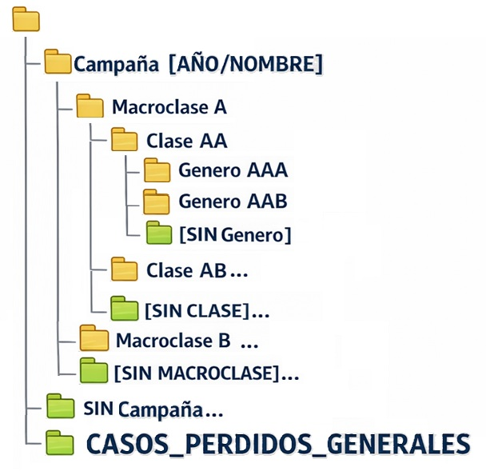

# Diseño proyecto ordenación datos

- Se ejecuta en cada directorio principal de cada una de las dos carpetas (MUPA / YCLH)
- Genera un log con todo lo que va haciendo para poder revisarlo
- Todo se guarda un excel con los campos (comprobar [Diseño base de datos](https://www.notion.so/Dise-o-base-de-datos-2ed030cfa42980f6add3d947de887546?pvs=21) para las definiciones)
    - uuid | specimen_id | original_path | macroclass_label | class_label | genera_label | fecha_captura  | fuente  | comentarios
        - Muchas estarán vacías, pero se irán recogiendo con lo que se pueda
        - En comentarios se irá poniendo las anotaciones automáticas de donde vienen
- Recorre el directorio en profundidad, no en anchura
    - Si el directorio está vacío se borra (hay copia con todo igualmente)
    - Si el directorio no contiene imágenes, pero contiene ficheros que potencialmente contengan anotaciones, se moverán a un directorio especial para ello, se renombrarán a <id>_<nombre_original> y se creará un excel que registre cada id su path original
        - En algún momento, un LLM que los lea y decida automáticamente lo que hay dentro
    - Si el directorio contiene otro tipo de archivos, se procede como con los que potencialmente tienen anotaciones pero en otro directorio distinto
    - Si contiene varias cosas, se saca todo lo que no sean imágenes de acuerdo a lo anterior, y se sigue el procesamiento habiendo ya solo imágenes
    - Extrae el path, y le pregunta al LLM si de ahí se pueden parsear las clases taxonómicas, el specimen_id o la campaña
        - El LLM usa respuesta estructurada para contestar
            - Si no se puede parsear nada, se sigue sin hacer nada
            - Si se puede parsear algo, se guarda, y se considera que para todo el directorio se mantienen esos campos, al no ser que haya discrepancias claras posteriormente, que se resolverán a mano
    - Con esto, se procesan las imágenes:
        - Se le intentan extraer los metadatos de tiempo
            - Si hay discrepancia con lo extraido del path, se pausa y el usuario decide si se usa uno, el otro, o se manda a algún directorio especial de decidir más tarde
        - Se parsea el nombre del archivo buscando patrón claro ccccsddddddddpp
            - Siendo
                - c caracter
                - s separador (-, _, , …)
                - d dígito
                - p placa o contraplaca (a o b)
            - Si se parsea directamente con regex, genial
                - Si hay discrepancia con lo del path, se gestiona como con la fecha
        - Se parsea el nombre del archivo buscando dddddddd
            - Si se parsea directamente con regex, abrir una ventana al usuario con una imagen aleatoria y su nombre, para que el usuario decida si ese directorio los números son el id, o es un número generado automáticamente por la cámara de fotos
                - Si es el id, se comprueba con lo del path, y se gestiona como se ha hecho anteriormente
        - Si no, extraer 50 nombres, y pasarselos a un LLM para que decida
            - Si se puede parsear el specimen_id, y de ser así que devuelva el regex a usar
            - Si se puede parsear alguno de los niveles taxonómicos, y de ser así que devuelva cual(es) y el regex a usar
            - Si puede parsear la fecha de la campaña, y de ser así el regex a usar
            - Cualquier posibilidad, un flag para revisión manual
        - En función de las combinaciones, tendrá que haber directorios para aprovechar la información (casos perdidos generales, casos perdidos de cada campaña, specimen_id pero sin otras cosas y así sucesivamente)
        - Si se devuelve un regex que no termina de funcionar, se le devuelve al LLM para que lo actualice o lo retire
    - Una vez se tiene la información extraída automáticamente de cada imagen, se pasa al excel, se asegura que los directorios correspondientes existan, y se copian las imágenes
    - Al copiarlas, aprovechar a estandarizar las imágenes
        - Pasar todas las imágenes al mismo formato
        - Nombres de los ficheros
            - <fecha_campaña>_<specimen_id>_<uuid> a lo mejor?
                - Igual asumir que el nombre inicial que tiene es el specimen_id, y si se corrige mas tarde corregir el nombre del fichero también
                    - Normalizar el nombre original entonces (espacios y demás)
- En general la parte del LLM suena un poco complicada, pero tengo código haciendo cosas similares, y creo que haciendo las cosas por modulitos y con copilot se puede implementar relativamente rápido, si algo da problemas, se decide si se descarta esa parte o se convierte en manual
- El árbol de directorios quedaría algo así como:
    
    
    
    Y luego cada fichero en función del nombre se sabe si se tiene el specimen_id o no
    
    - En general la lógica sería
        1. **¿Sé la Campaña?**
            - **NO:** Ve a la carpeta [SIN CAMPAÑA].
            - **SÍ:** Entra a la carpeta de esa Campaña.
        2. **¿Sé la Macroclase?**
            - **NO:** Ve a la carpeta _SIN_MACROCLASE (dentro de lo anterior).
            - **SÍ:** Entra a la carpeta de esa Macroclase.
        3. **¿Sé la Clase?**
            - **NO:** Ve a la carpeta _SIN_CLASE (dentro de lo anterior).
            - **SÍ:** Guárdalo en la carpeta de esa Clase.
    - En general, además tendríamos un archivo con las anotaciones de momento, otro con los hashes y sus imágenes, otro con los logs de lo que va ocurriendo, otro con el registro de los archivos de texto (+ directorio en el que se almacenan), y otro con el registro de los archivos “otros” (+ directorio en el que se almacenan)
- Al mover los ficheros a su directorio, nos empezamos a encontrar con los potenciales duplicados. Una opcion sería asumirlos, llamarlos diferentes, y continuar, pero igual es un buen momento para irlos controlando al juntarlos
    - La forma de comprobar dos imágenes, es usar un hash perceptual, y tener un registro uuid - hash. Si vemos que no funciona se optará por medidas más complejas, pero probablemente con esto valga y es la opción más simple
        - Si se detecta un duplicado de imágenes, se trata de juntar los campos que se hayan podido extraer para decidir bien el directorio
            - Si hay campos que no coinciden, se pide confirmación manual antes de continuar
    - Si al mover las imágenes hay dos con el mismo nombre
        - Pedir confirmación manual
- Si las confirmaciones manuales no resultan prácticas, redirigir todo a algún directorio para revisar manualmente las cosas que lo requieran
- A la hora de implementar, los módulos (/librerías) serían:
    - Módulo loggeo de cosas
        - Funciones para ir loggeando las distintas acciones posibles
    - Módulo actualizar excel
        - Generar uuid y llevar la cuenta
        - Añadir nuevas entradas al excel de anotacion (+ en comentarios poner bien de donde vienen las automáticas)
        - Actualizar excels de registro de archivos de texto, y “otros”
    - Módulo pedir revisión manual
        - Solo elegir un campo entre varias opciones
        - Elegir varios campos entre varias opciones
        - Mostrar imagen y pedir confirmación
    - Módulo gestión archivos
        - Mover archivos
        - Borrar directorios
        - Extraer metadatos
        - Ver extensiones si son imágenes, texto u otro
    - Módulo consultas LLM
        - Contenido del fichero de texto (en algún momento)
        - ¿Path corresponde a clase taxonómica, specimen_id o año campaña?
        - ¿Estos filenames se pueden parsear de alguna forma para extraer la clase taxonómica, el specimen_id, o el año campaña?
        - Regex que me diste ha fallado, ¿Cómo lo actualizamos?
    - Módulo lógica obtener datos desde path + filename con las consultas al LLM, regex y demás
    - Módulo comprobar duplicación de imágenes